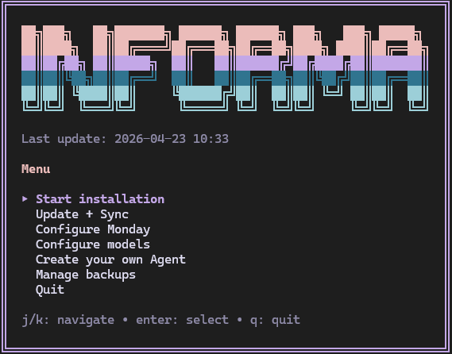
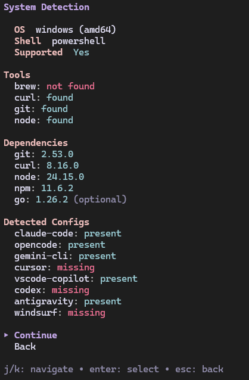
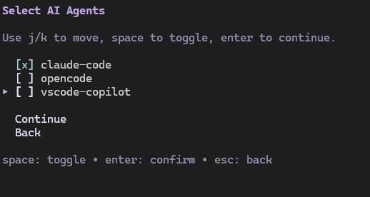
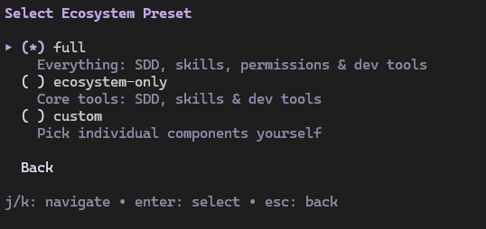
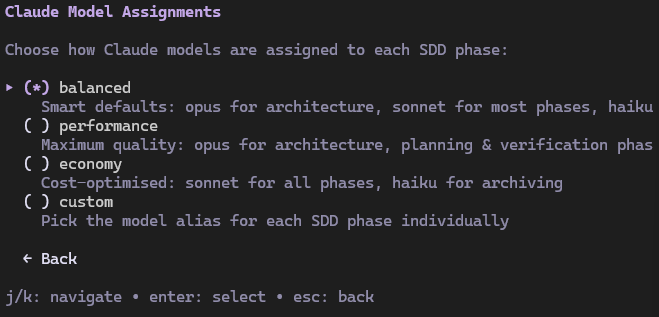
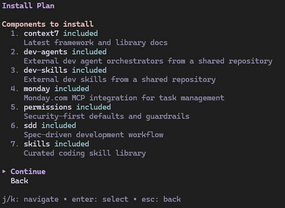
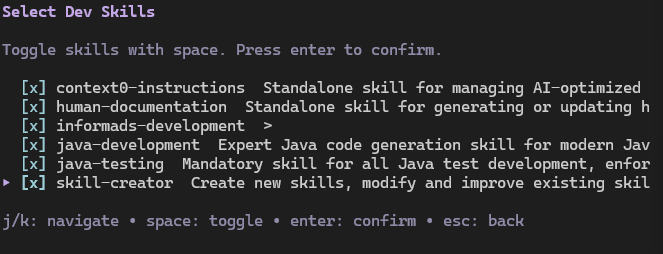
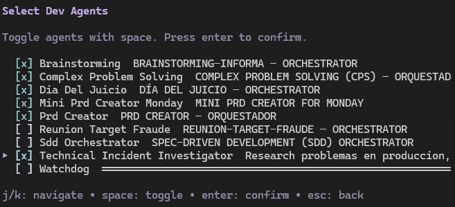
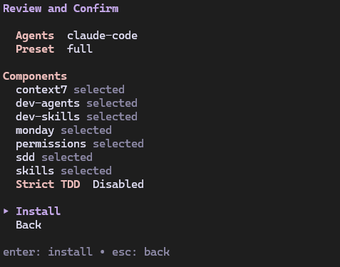

<div align="center">

<h1>Informa Wizard</h1>

<p><strong>Configura tus agentes de IA con un solo comando. SDD, skills, agentes y servidores MCP — listos para usar.</strong></p>

<p>
<a href="LICENSE"></a>


</p>

</div>

---

## Qué hace

Es un **configurador de ecosistema** -- toma cualquier agente de IA que uses y lo potencia con el stack de Informa Wizard: memoria persistente, flujo de trabajo Spec-Driven Development, librería de skills curadas, servidores MCP (incluida la integración con Monday.com), permisos con seguridad por defecto, y asignación de modelos por fase para que cada paso del SDD pueda correr en un modelo distinto.

**Antes**: "Instalé Claude Code / OpenCode / VS Code, pero es solo un chatbot que escribe código."

**Después**: Tu agente ahora tiene memoria, skills, workflow, herramientas MCP y gestión de tareas en Monday.com integradas en el ciclo de desarrollo.

### Agentes soportados

| Agente | Modelo de delegación | Característica clave |
|--------|:---:|---|
| **Claude Code** | Full (herramienta Task) | Sub-agentes, agentes personalizados en `~/.claude/agents/` |
| **OpenCode** | Full (overlay multi-modo) | Routing de modelos por fase, definiciones de agente en JSON |
| **VS Code Copilot** | Full (runSubagent) | Archivos de agente en `prompts/`, ejecución paralela |

---

## Pre-requisitos

Instala Go 1.24+ si no lo tienes:

```bash
# Windows (chocolatey)
choco install golang

# macOS (homebrew)
brew install go

# Linux
sudo apt install golang  # o tu gestor de paquetes
```

Verifica: `go version`

> **Importante:** Usa la versión estable de VS Code, no VS Code Insiders. La build de Insiders puede tener problemas de compatibilidad con la configuración de agentes y MCP del wizard.

---

## Instalación

```bash
git clone https://gitlab.informa.tools/ai/wizard/informa-wizard.git
cd informa-wizard
go install ./cmd/informa-wizard
```

---

### Tras la instalación: ejecutar el wizard

```bash
informa-wizard
```

---

## Recorrido por la instalación

<details>
<summary><strong>Haz click para ver las capturas del flujo de instalación</strong></summary>

**1. Menú principal**



**2. Detección del sistema** — comprueba herramientas, dependencias y qué configuraciones de agente están presentes



**3. Selección de agentes** — elige los agentes a configurar



**4. Selección de preset** — Full, Ecosystem o Custom



**5. Modo Strict TDD**



**6. Configurar modelos de Claude** — asigna modelos por fase del SDD


**7. Selección de skills** — elige las skills curadas a instalar



**8. Selección de dev-skills** — skills externas del repo compartido dev-skills



**9. Selección de dev-agents** — agentes orquestadores del repo dev-orchestrators



**10. Revisar y confirmar** — resumen final antes de instalar



</details>

---

### Tras instalar el wizard: configuración a nivel de proyecto

Una vez configurados tus agentes, abre tu agente de IA en un proyecto y ejecuta estos dos comandos para registrar el contexto del proyecto:

| Comando | Qué hace | Cuándo re-ejecutar |
|---------|----------|---------------------|
| `/sdd-init` | Detecta el stack, capacidades de testing, activa Strict TDD Mode si está disponible | Cuando tu proyecto añade/quita frameworks de test, o la primera vez en un proyecto nuevo |
| `/skill-registry` | Escanea las skills instaladas y las convenciones del proyecto, construye el registro | Tras instalar/quitar skills, o la primera vez en un proyecto nuevo |

**No son obligatorios** para el uso básico. El orquestador de SDD ejecuta `/sdd-init` automáticamente si no detecta contexto. Pero si algo cambió en tu proyecto (nuevo test runner, nuevas dependencias), re-ejecutarlos manualmente garantiza que los agentes tengan el contexto al día.

---

## Integración con Monday.com

Informa Wizard incluye integración con Monday.com. Durante la instalación, proporciona tus credenciales:

```bash
informa-wizard install --component monday --monday-token "tu-api-token" --monday-board "board-id"
```

Esto configura el servidor MCP de Monday para todos tus agentes. El ciclo SDD luego automáticamente:
- **sdd-tasks**: Busca items existentes en Monday o crea nuevos con subtareas
- **sdd-apply**: Actualiza el estado de las subtareas a Done a medida que se completan
- **sdd-verify**: Pone el item en Done o Stuck según el resultado de la verificación

---

## Backups

Cada instalación, sync y actualización hace un snapshot automático de los directorios de configuración de tus agentes. Los backups están **comprimidos** (tar.gz), **deduplicados** (las configs idénticas no se re-guardan) y **auto-purgados** (mantiene los 5 más recientes). Fija backups importantes desde la TUI (tecla `p`) para protegerlos del purgado.

Mira la [Guía de Backup y Rollback](docs/rollback.md) para más detalles.

---

## Documentación

| Tema | Descripción |
|------|-------------|
| [Uso previsto](docs/intended-usage.md) | Cómo está pensado usar informa-wizard — el modelo mental |
| [Agentes](docs/agents.md) | Agentes soportados, matriz de funcionalidades, rutas de config y notas por agente |
| [Componentes, Skills y Presets](docs/components.md) | Todos los componentes, comportamiento de GGA, catálogo de skills y definiciones de presets |
| [Uso](docs/usage.md) | TUI interactiva, flags de CLI y gestión de dependencias |
| [Backup y Rollback](docs/rollback.md) | Retención de backups, compresión, deduplicación, pinning y restore |
| [Plataformas](docs/platforms.md) | Plataformas soportadas, notas de Windows, verificación de seguridad, rutas de config |
| [Arquitectura y Desarrollo](docs/architecture.md) | Layout del código, testing y desarrollo |

---

<div align="center">
<a href="LICENSE"></a>
</div>
